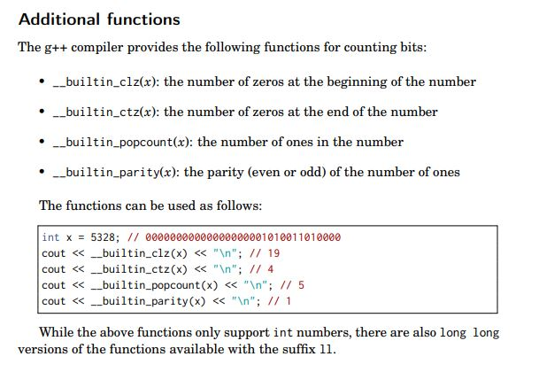

## 10. Bit Manipulation

### 1. Some Built Functions

### 2. Bit & Dynamic Programming

We can uses bits to represent the state of DP algorithm, thus we may implement the DP in an efficient way in some situations.