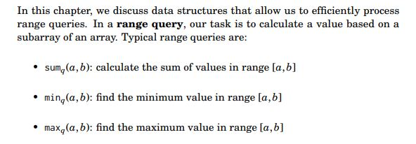

## 9. Range Queries



### 1. Sum Queries
Maintain a prefix sum array, i.e. $sum[i] = \sum_{j=0}^{j=i} a[j]$. Thus, each queries `[a,b]` can be calculated as $sum[b] - sum[a-1]$. Time complexity is `o(n)`, and space complexity is `O(n)`.

## 2. Min/Max Queries
Min and max queries are similar. Thus, we can only consider min or max operation.

Solution: (Pre-Process all power-of-2 ranges):

Given the number of queries is very large, we try to minimize the time complexity for each query $min_q(a,b)$. First, we preprocess all possible $min_q(a,b)$ where `b-a+1` (the length of the range) is a power of two, i.e. $2, 4, 8, ..., 2^k$. The time complexity is O(nlogn), since we need to go through the whole array O(n) for each power (at most log n distinct powers).

For any query, $min_q(a,b) = min(min_q(a, a+k-1), min_q(a+k, b))$, where `k=x&(-x)` is length of the first range, and `x=b-a+1`. Why? `x` is the length of the range `(a,b)`, `k=x&(-x)` is the least number of power (of 2) compositing of `x`. Thus, the time complexity of each query is O(log M), where $2^M$ is the maximum value of the elements in the array.

The problem of this solution is that we can not modify the array, since we need to re-compute all possible power-of-2 ranges again, if we modify some elements.

## 3. Binary Indexed Tree
We can modify the array in O(log n), and query in O(log n). For simplisity, we denote `bit(x) = x&(-x)`, i.e. we use `bit` function to get the least number of power of 2 compositing of x. 

Binary indexed tree holds the condition that:
1. Each position `i` should `care` `k` values just be in front of it: `nums[i-k+1],nums[i-k+2],...,nums[i-k+k]`, where `k=bit(i)`.

2. Here, `care` can be `sum` operation, or any other operations that satify the aggregation principles.

3. For each query, e.g. $sum_q(a,b)$, we can then use $sum_q(1, b) - sum_q(1,a-1)$, and $sum_q(1, i)$ can be computed in O(log n) as follow:
```c++
vector<int> care;
vector<int> nums;

int bit(x){
    return x&(-x);
}

int sum(int i){
    //return the sum of nums[1], nums[2],...nums[i]
    int s = 0;
    for(;i>0;i=i^bit(i)){
        s += care[i];
    }
    return s;
}

// how to modify nums and update care?
void add_v_to_num_i(int i, int v){
    // add v to all care elements that cover i-th elements
    for(;i<care.size();i+=bit(i)){care[i] += v;}
}

// initial the care array
void init(){
    for(int i=0;i<nums.size();i++>){
        care.push_back(0);
    }
    for(int i=0;i<nums.size();i++){
        add_v_to_num_i(i, nums[i]);
    }
}

```

We can find that the `aggregation principles` should satisfy:

1. We can calculate the target (of range `(a,b)`) from another ranges, such as `(1,a-1)` and `(1, b)`.

2. We can modify some elements by updating the care array along the bit path while do not break BIT conditions.


## 4. Segment Tree
Each operation is O(log n). 